# Experimental Analysis Report: RowGroup + Segment Zonemap vs RowGroup + Column Sketch

## 1. Overview

The goal of these experiments is to explain when column sketch pruning improves scan execution compared with segment-level zonemap pruning in the customized DuckDB scan path.

The report uses the actual experiment summaries in:

```text
experiments/results/explain_metrics_summary.csv
```

Only two modes are analyzed:

| Mode | Row-Group Zonemap | Segment Zonemap | Segment Sketch |
| --- | --- | --- | --- |
| `rowgroup_plus_segment_zonemap` | on | on | off |
| `rowgroup_plus_sketch` | on | off | on |

This comparison is meaningful because both modes keep row-group pruning enabled. Therefore, differences in `vectors_processed` are primarily attributable to the segment-level access path: segment zonemap vs column sketch.

The smoke-test CSV files and non-primary modes are intentionally excluded from the analysis.

## 2. Experimental Framework

The workloads are synthetic SQL suites designed to isolate one factor at a time:

- **Selectivity**: query ranges vary from narrow predicates to broad predicates.
- **Layout**: random, sorted, and block-sorted physical orderings are compared.
- **NDV / cardinality**: low, medium, and high distinct-value regimes are compared.
- **Distribution**: uniform and hotspot/skewed distributions are compared.
- **Predicate type**: equality, less-than, between, and conjunctive predicates are compared.

The plotting script parses `query_name` to recover experimental variables:

- `block_0_1_pct` -> layout `block_sorted`, selectivity `0.1`
- `medium_20_pct` -> NDV `medium`, selectivity `20`
- `hotspot_between_nonhotspot_band` -> distribution `hotspot`, predicate `between`, target `nonhotspot`
- `high_conjunct` -> NDV `high`, predicate type `conjunct`

This setup is appropriate because row-group zonemap pruning is controlled in both modes. The experiments therefore isolate the segment-level decision while still preserving the realistic scan behavior of the modified engine.

Data-quality note: `ndv_predicates / rowgroup_plus_sketch` contains incomplete repetitions for conjunctive runs. Those results are still shown, but the predicate-type latency findings should be interpreted cautiously.

Plotting note: latency values are read from `avg_total_time_s` in seconds, but the generated latency plots display the y-axis in milliseconds for readability. The underlying CSV values and textual analysis remain in seconds.

Chart-type note: selectivity plots are line charts because selectivity is ordered and numeric. Layout, NDV, distribution, and predicate-type plots are grouped bar charts because their x-axes are categorical.

## 3. Experiments

## Experiment 1 — Selectivity Sweep

### 1. Hypothesis

Sketch pruning should reduce more scan work at selective predicates, but its latency advantage should disappear when the predicate becomes broad and sketch overhead outweighs saved scan work.

### 2. Setup

- **Dataset**: `layout_selectivity`
- **Table subset**: block-sorted layout
- **Query structure**: `a BETWEEN low AND high`
- **Variable varied**: selectivity from `0.1%` to `90%`
- **Held constant**: layout, table schema, predicate form, row-group pruning

### 3. Why this setup is appropriate

Block-sorted data gives row-group pruning some coarse clustering benefit while still leaving segment-level pruning opportunities inside surviving row groups. This isolates the pruning-vs-overhead tradeoff across selectivity.

### 4. Graphs

#### Graph A — Vectors Processed

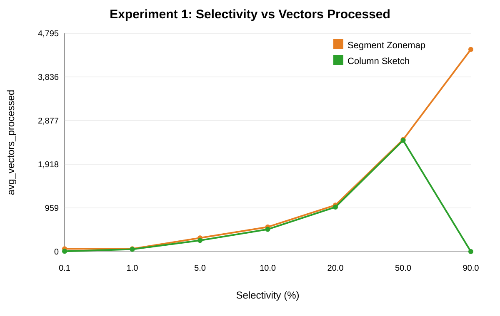

#### Graph B — Latency

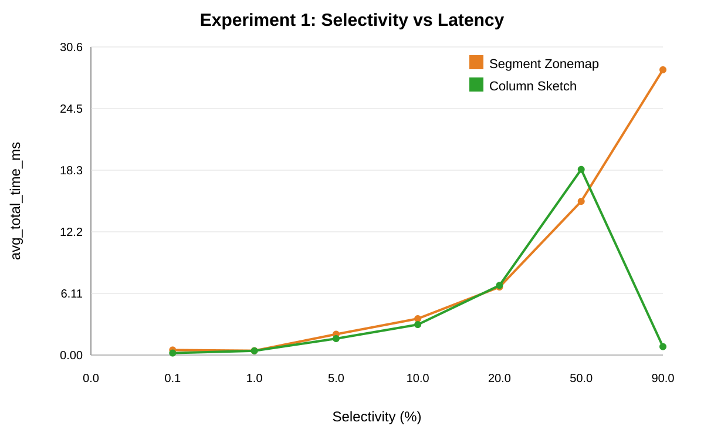

### 5. Graph Interpretation

**Vectors processed:** Sketch usually processes fewer vectors than segment zonemap. At `0.1%`, vectors drop from `60` to `6`. At `5%`, they drop from `300` to `245`. At `50%`, the reduction is small: `2460` to `2442`.

**Latency:** The latency benefit follows the vector reduction only when the reduction is meaningful. At `5%`, sketch is faster (`0.00163s` vs `0.00207s`). At `50%`, sketch is slower (`0.01842s` vs `0.01525s`) despite a small vector reduction.

The `90%` case shows a very large sketch win in the current CSV (`4440` vectors to `0`, `0.02831s` to `0.00083s`). That result is real in the output file, but it should be sanity-checked because broad predicates are not usually where pruning is expected to be strongest.

### 6. Key Takeaway

Sketch is useful when it substantially reduces vectors processed. When the vector reduction is small, segment zonemap is competitive or better because it has lower overhead.

## Experiment 2 — Layout Sensitivity

### 1. Hypothesis

Physical layout changes how much work remains after row-group pruning. Sketch should help most when segment-level value absence remains visible inside surviving row groups.

### 2. Setup

- **Dataset**: `layout_selectivity`
- **Layouts**: random, sorted, block-sorted
- **Query structure**: range predicates over `a`
- **Variable varied**: physical layout
- **Held constant**: schema, row count, value distribution, selectivity sweep, row-group pruning

### 3. Why this setup is appropriate

Only row ordering changes. Therefore, changes in pruning behavior are caused by physical clustering rather than different values or predicates.

### 4. Graphs

#### Graph A — Vectors Processed

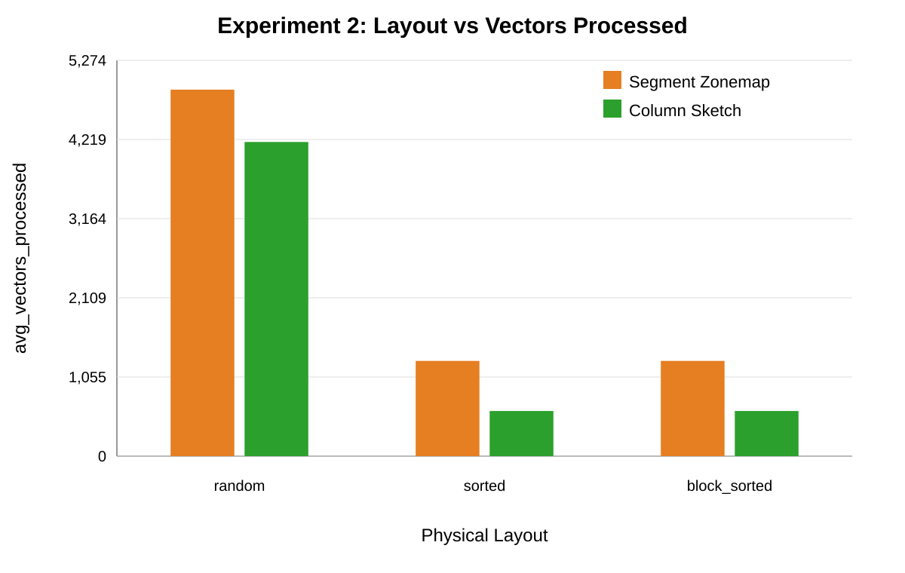

#### Graph B — Latency

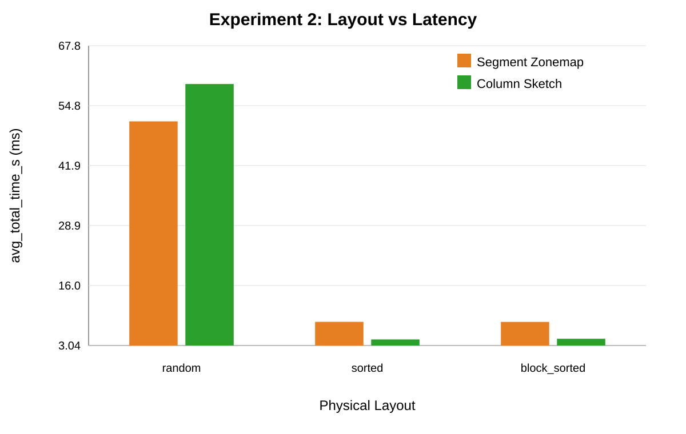

### 5. Graph Interpretation

**Vectors processed:** Averaged across selectivities, sketch reduces vectors for every layout:

- random: `4883.0` -> `4185.6`
- sorted: `1268.6` -> `601.3`
- block-sorted: `1268.6` -> `601.3`

**Latency:** Sketch is faster on sorted and block-sorted layouts (`0.0043s` and `0.0045s` vs `0.0081s`). On random layout, sketch processes fewer vectors but is slower (`0.0595s` vs `0.0514s`), which indicates overhead dominates when pruning is not strong enough.

### 6. Key Takeaway

Layout determines whether segment-level pruning is worth paying for. Sketch helps most when clustering leaves rejectable segments; on random data, reduced vectors do not necessarily produce lower latency.

## Experiment 3 — NDV / Cardinality

### 1. Hypothesis

Higher NDV should make sketch pruning more useful because queried values are absent from more segments. Low NDV should reduce sketch effectiveness because many segments contain the same repeated values.

### 2. Setup

- **Dataset**: `ndv_selectivity`
- **NDV levels**: low, medium, high
- **Query structure**: less-than range predicates
- **Variable varied**: NDV of column `a`
- **Held constant**: row count, schema, predicate family, row-group pruning

### 3. Why this setup is appropriate

The suite changes value cardinality while keeping query shape fixed. This isolates how metadata granularity interacts with value coverage inside segments.

### 4. Graphs

#### Graph A — Vectors Processed

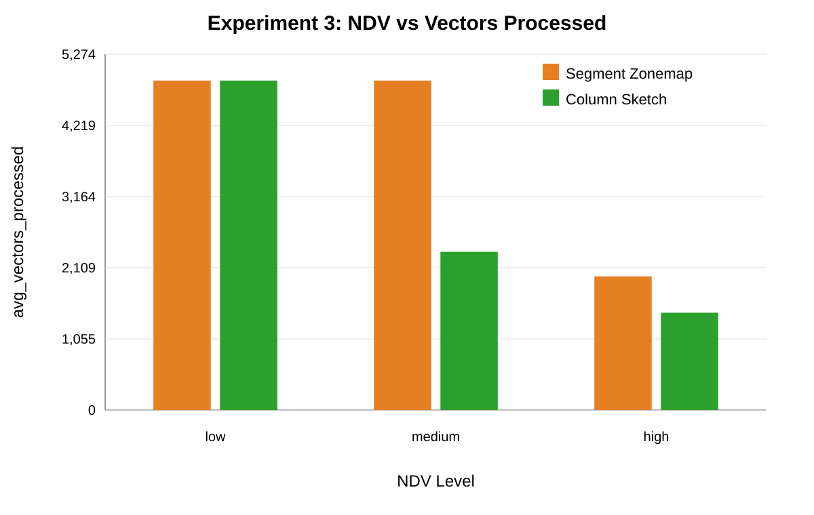

#### Graph B — Latency

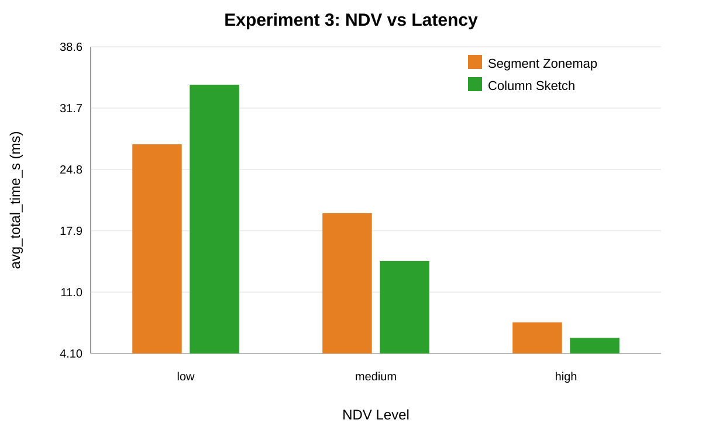

### 5. Graph Interpretation

**Vectors processed:** Low NDV shows no sketch reduction (`4883.0` vs `4883.0`). Medium NDV shows a large reduction (`4883.0` -> `2344.3`). High NDV also improves (`1980.0` -> `1441.8`).

**Latency:** Low NDV makes sketch slower (`0.0344s` vs `0.0276s`) because it adds overhead without reducing scan work. Medium and high NDV support the hypothesis: sketch is faster at medium NDV (`0.0145s` vs `0.0199s`) and high NDV (`0.0059s` vs `0.0076s`).

### 6. Key Takeaway

NDV is one of the clearest predictors of sketch usefulness. Sketch wins when cardinality makes segment-level absence informative.

## Experiment 4 — Distribution / Skew

### 1. Hypothesis

Skew changes whether a value or range appears broadly across segments. Sketch should help more when the target values are absent from many segments, and less when hotspot values appear everywhere.

### 2. Setup

- **Dataset**: `distribution_predicates`
- **Distributions**: uniform and hotspot
- **Query structure**: equality and between predicates
- **Variable varied**: value distribution
- **Held constant**: schema, row count, predicate classes, row-group pruning

### 3. Why this setup is appropriate

Uniform and hotspot datasets use matched predicate forms. This isolates the effect of skew on segment-level metadata effectiveness.

### 4. Graphs

#### Graph A — Vectors Processed

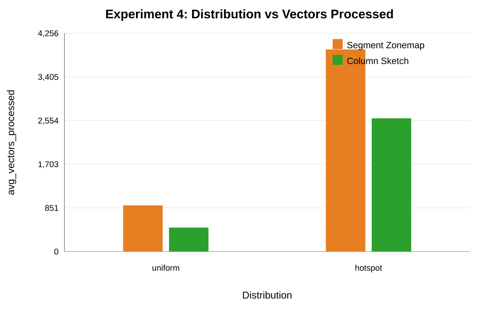

#### Graph B — Latency

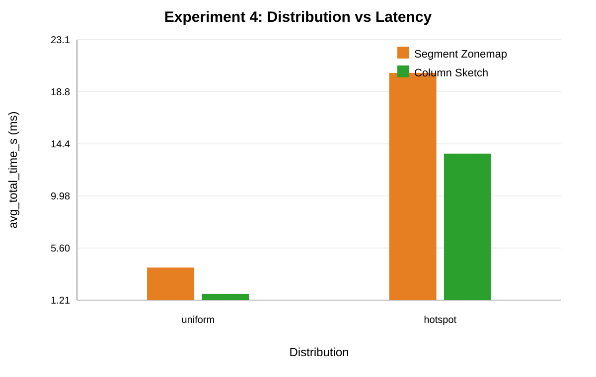

### 5. Graph Interpretation

**Vectors processed:** Sketch reduces scan work under both distributions:

- uniform: `900.0` -> `467.0`
- hotspot: `3941.0` -> `2598.5`

**Latency:** Sketch also improves latency:

- uniform: `0.0040s` -> `0.0017s`
- hotspot: `0.0204s` -> `0.0135s`

The hotspot workload still processes more vectors overall because dense values are harder to exclude from segments.

### 6. Key Takeaway

Sketch helps under skew, but skew can also reduce pruning opportunities when hotspot values are present in many segments.

## Experiment 5 — Predicate Type

### 1. Hypothesis

Predicate form affects whether sketch pruning can fire and whether it is worth the overhead. Range-style predicates should benefit more than equality if equality is not strongly supported by the sketch pruning path.

### 2. Setup

- **Dataset**: `ndv_predicates`
- **Predicate types**: equality, less-than, between, conjunctive
- **Variable varied**: predicate form
- **Held constant**: row-group pruning and the NDV families included in the suite

### 3. Why this setup is appropriate

The same NDV families are tested under different predicate forms. This exposes implementation-specific behavior in the pruning path.

### 4. Graphs

#### Graph A — Vectors Processed

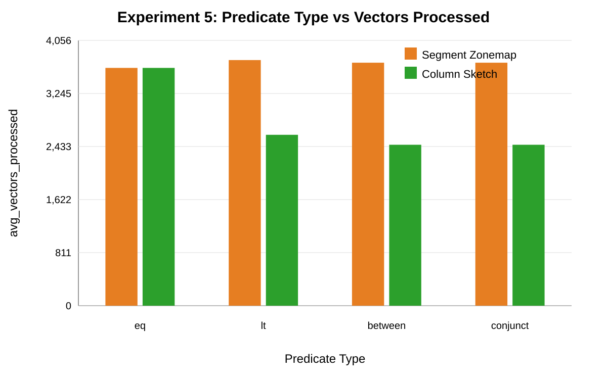

#### Graph B — Latency

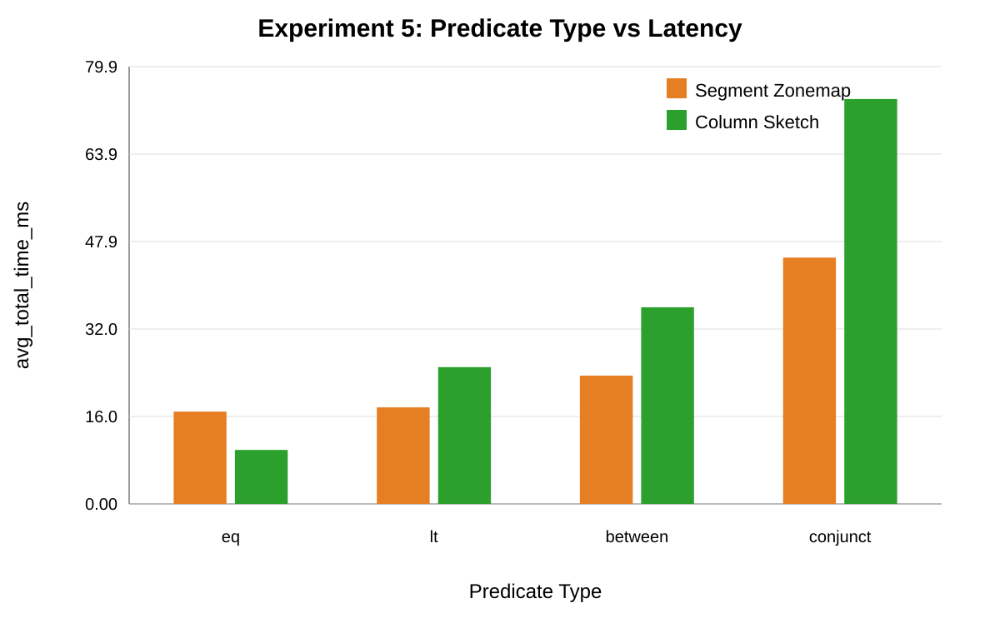

### 5. Graph Interpretation

**Vectors processed:** Equality shows no vector reduction (`3635.3` vs `3635.3`). Less-than and between reduce vectors substantially:

- less-than: `3755.3` -> `2612.7`
- between: `3715.3` -> `2460.3`
- conjunctive: `3715.3` -> `2460.3`

**Latency:** The predicate-type results show overhead clearly. Less-than, between, and conjunctive predicates process fewer vectors under sketch, but sketch is slower:

- less-than: `0.0250s` vs `0.0176s`
- between: `0.0359s` vs `0.0234s`
- conjunctive: `0.0740s` vs `0.0450s`

Equality has equal vector counts but lower sketch latency in the CSV (`0.0099s` vs `0.0169s`). Because there is no scan-work reduction, this should not be interpreted as a sketch-pruning win; it is likely timing noise or another execution effect.

### 6. Key Takeaway

Predicate type confirms why `vectors_processed` is essential. Sketch can reduce scan work but still lose on latency when predicate evaluation and sketch checks are expensive.

## Experiment 6 — Focused Segment-Level Comparison

### 1. Hypothesis

On a fixed medium-NDV workload, sketch should outperform segment zonemap at selective and moderately selective predicates, but lose or tie when selectivity becomes broad.

### 2. Setup

- **Dataset**: `ndv_selectivity`
- **Focused subset**: medium NDV
- **Query structure**: `a < threshold`
- **Variable varied**: selectivity from `1%` to `90%`
- **Held constant**: NDV, schema, predicate type, row-group pruning

### 3. Why this setup is appropriate

This is the cleanest focused comparison. The dataset and predicate class are fixed, and the only changing query property is selectivity. Both modes receive identical row-group pruning.

### 4. Graphs

#### Graph A — Vectors Processed

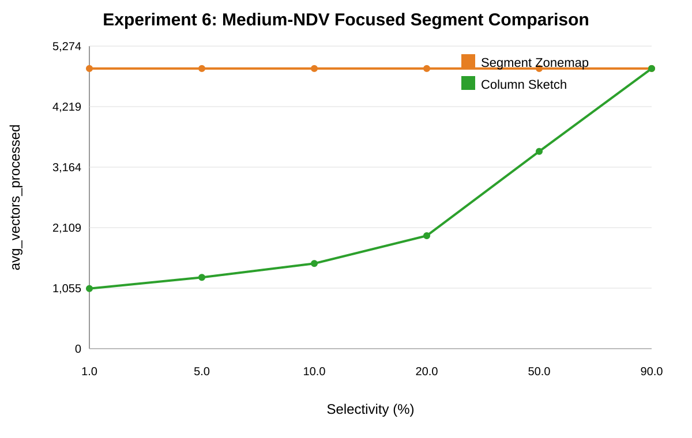

#### Graph B — Latency

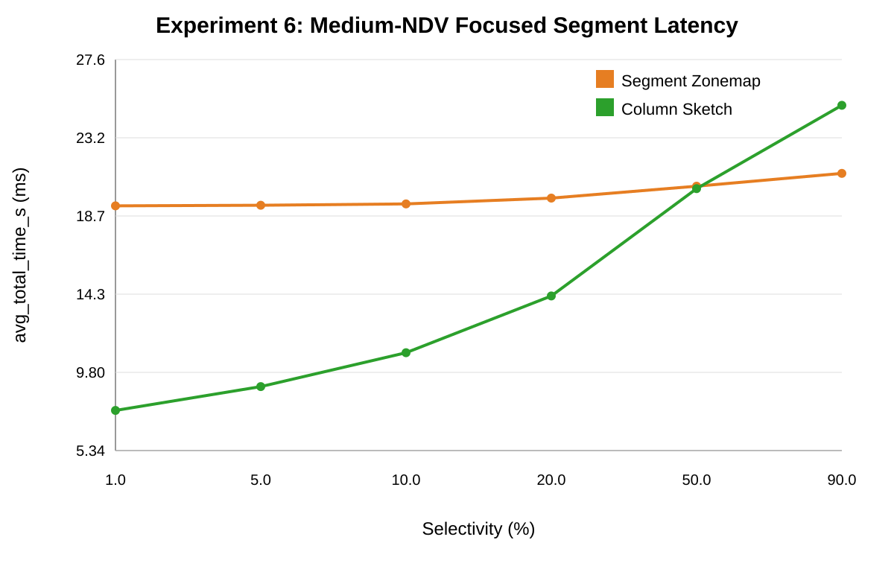

### 5. Graph Interpretation

**Vectors processed:** Sketch strongly reduces vectors at low and medium selectivity:

- `1%`: `4883` -> `1048`
- `5%`: `4883` -> `1243`
- `10%`: `4883` -> `1485`
- `20%`: `4883` -> `1969`
- `50%`: `4883` -> `3438`
- `90%`: `4883` -> `4883`

**Latency:** Sketch is faster through `20%`, roughly tied at `50%`, and slower at `90%`:

- `1%`: `0.01930s` -> `0.00763s`
- `20%`: `0.01974s` -> `0.01416s`
- `50%`: `0.02042s` -> `0.02028s`
- `90%`: `0.02115s` -> `0.02503s`

This is the clearest crossover result in the CSVs.

### 6. Key Takeaway

Sketch has a selectivity threshold. It wins when it prunes many vectors, ties when pruning is moderate, and loses when it cannot prune.

## 4. Cross-Experiment Insights

Sketch wins when:

- NDV is medium or high enough for values to be absent from many segments.
- selectivity is low to moderate.
- layout leaves segment-level pruning opportunities after row-group pruning.
- distribution makes queried values sparse in many segments.

Segment zonemap wins or ties when:

- sketch and zonemap process similar numbers of vectors.
- selectivity is broad.
- NDV is low and most segments contain the queried values.
- sketch overhead is larger than the scan work avoided.

The strongest evidence for sketch is the medium-NDV focused sweep: vectors drop from `4883` to `1048` at `1%`, and latency drops from `0.01930s` to `0.00763s`.

The strongest evidence for overhead is the predicate-type suite: sketch reduces vectors for range predicates but is slower overall.

## 5. Metric Interpretation

`vectors_processed` is the most important internal metric because it measures how much scan work survives metadata pruning. It directly answers whether an access path avoided scanning data.

Latency is required but can diverge from vectors because it includes:

- sketch evaluation overhead
- predicate evaluation cost
- aggregation cost
- cache effects
- cluster scheduling noise
- profiler overhead

Pruning counters should be interpreted as diagnostic evidence:

- `row_groups_pruned_by_zonemap` should be similar across the two focused modes.
- `segments_pruned_by_zonemap` explains segment-zonemap behavior.
- `segments_pruned_by_sketch` explains sketch behavior.
- a high segment-pruning counter matters only if `vectors_processed` also drops.

In these CSVs, segment zonemap counters are often zero or near zero, while sketch counters are frequently large. That suggests the current segment zonemap path is not providing much additional benefit beyond row-group pruning for these workloads.

## 6. Python Plotting Script

The plotting script is:

```text
experiments/plot_access_path_analysis.py
```

It reads:

```text
experiments/results/explain_metrics_summary.csv
```

It filters to:

```text
rowgroup_plus_segment_zonemap
rowgroup_plus_sketch
```

It writes plots to:

```text
plots/
  selectivity/
  layout/
  ndv/
  distribution/
  predicate/
  focused/
```

The script uses consistent colors:

- zonemap = orange
- sketch = green

It uses larger axis labels, plain integer formatting for vector-count axes, explicit x-axis titles, and zoomed millisecond latency axes. It uses pandas and matplotlib when available. On this machine, those packages were unavailable, so the script generated equivalent SVG plots using its standard-library fallback.

Run:

```bash
python3 experiments/plot_access_path_analysis.py
```

## 7. Final Insights

1. The controlled comparison shows sketch often reduces `vectors_processed` more than segment zonemap.

2. Sketch is not automatically faster; it wins only when saved scan work exceeds sketch-check overhead.

3. Medium NDV is the clearest success case for sketch in the current results.

4. Low NDV is a poor case for sketch because most segments contain the queried values.

5. Random layout can make sketch reduce vectors without improving latency, which shows overhead dominance.

6. Predicate type matters: equality shows no scan-work reduction, while range-style predicates reduce vectors but may still lose on latency.

7. Segment zonemap pruning appears weak in these workloads, with near-zero segment-zonemap counters in the focused modes.

8. The best final-report story is the crossover: sketch wins at selective predicates, ties at moderate selectivity, and loses when predicates become too broad to prune.
